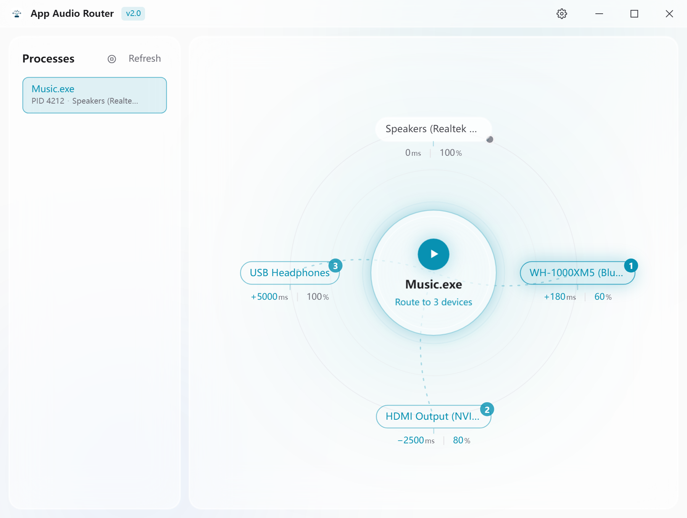
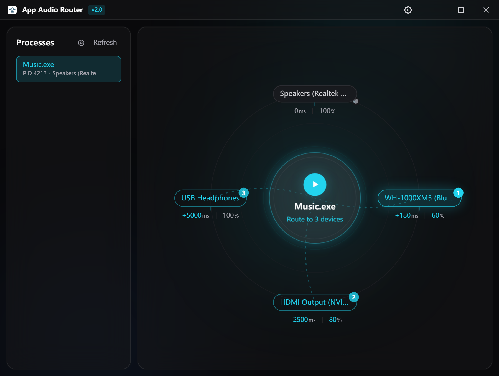

<p align="center">
  
</p>

# App Audio Router

**Per-app audio routing for Windows: send one program's sound to several playback devices at once, each with its own delay compensation and its own volume.**

<p align="center">
  <a href="https://github.com/Eververdants/AppAudioRouter/actions/workflows/ci.yml"></a>
  
  
  <a href="LICENSE"></a>
  
</p>

<p align="center">
  <strong>English</strong> · <a href="README.zh-CN.md">简体中文</a>
</p>

> **App Audio Router is a free, open-source desktop application for Windows 10 and Windows 11 that routes the audio of individual programs to the playback devices you choose.** It can send one application to several devices at the same time, and it lets you tune each device separately — a delay compensation to line a Bluetooth headset up with wired speakers, and a volume to balance how loud each device is. Everything is done with the Windows Core Audio API from a single native binary: there is no virtual audio driver to install and no third-party executable to bundle.

---

## What is App Audio Router?

App Audio Router (**AAR**) is a per-application audio router for Windows. Windows itself only lets an application play to one output at a time; App Audio Router lifts that restriction. Pick a program, pick one or more playback devices, and the program's audio goes to all of them at once — live, without restarting the program.

It is aimed at ordinary users rather than audio engineers. There is no mixer graph, no virtual cable and no driver installation: the whole app is one window with a process list on the left and the **concentric router** in the middle — the selected process at the centre, your playback devices on the outer ring — with an activity log joining them on the right once the window is wide enough.

| | |
|---|---|
| **What it is** | Per-app audio routing tool for Windows (one app → many devices) |
| **Platform** | Windows 10 / Windows 11, 64-bit |
| **Latest version** | 2.1.0 |
| **Installer** | MSI or NSIS setup from [Releases](https://github.com/Eververdants/AppAudioRouter/releases) |
| **Licence** | MIT |
| **UI languages** | English, Simplified Chinese |
| **External dependencies** | None — no virtual audio driver, no helper executable |
| **Built with** | Tauri 2, Rust, React 19, TypeScript, TailwindCSS, Vite |
| **Source code** | https://github.com/Eververdants/AppAudioRouter |

## Screenshots

The same route in both themes: `Music.exe` is playing to a Bluetooth headset, an HDMI output and USB headphones, with a delay in milliseconds and a volume in percent under each device.





## Features

### Routing

- **One app → many devices.** Select one or more processes (`click`, or `Ctrl`+`click` for several) and one or more devices; the audio is mirrored to all of them at once.
- **Applies immediately.** A running program is re-pointed to the selected devices without a restart or a settings dialog reboot.
- **Ordered targets.** The first device becomes the program's native endpoint, handled by Windows itself; every further device receives a real-time copy of the stream.
- **Stop on demand.** Stop routing and the program returns to the current system default device.
- **Auto-remember.** Routing rules are stored per executable name and restored when that program plays again.

### Per-device fine-tuning

- **Delay compensation** — a signed millisecond value per device to align a fast device with a slow one, for example wired speakers against a Bluetooth headset whose codec adds inherent latency. Range and step are configurable (±1/2/5/10 s; 1/10/50/100/1000 ms, 10 ms by default).
- **Volume balance** — a 0–100 % value per device that attenuates that device relative to the loudest one in the route, so a quiet headset and a loud speaker rig can be brought in line.
- **Editable in place** — drag sideways, scroll, use the arrow keys (hold `Shift` for ten steps), or click a value and type an exact number. Both values sit under the device node and share one set of gestures.

### Stays out of the way

- **Live lists.** The device list and the process list follow the audio engine on their own — plug in a headset, or start and stop playback in an app, and both lists update without pressing anything. This uses Core Audio's own change notifications, not a polling timer.
- **System tray.** A tray icon appears while the app runs: left click shows or hides the window, the right-click menu has *Show / hide* and *Quit*.
- **Close to tray.** Optionally, the close button hides the window instead of quitting, so routing keeps running with no window on screen. Off by default; `Quit` is the action that stops the routes.
- **Start with Windows.** Optionally registers the app under your user's startup entries (`HKCU\Software\Microsoft\Windows\CurrentVersion\Run`), launching silently into the tray so remembered routes are ready before you open anything. Turn it back off from the same switch, or from Task Manager → Startup apps.

### Interface and overhead

- **Concentric router UI** — process at the centre, devices on an outer ring, flow lines that show what is currently routed, ripple feedback when a route is applied.
- **Light and dark themes**, English and Simplified Chinese, both switchable from the title bar; the preferred theme and language are applied before the first frame paints, so there is no flash on startup.
- **Low background cost** — the app never polls the audio engine. It registers for change notifications and re-reads the lists when Windows says something actually moved, and each re-read that turns up no visible change is not even logged.
- **Fast cold start** — the window is created hidden and is revealed once the first frame is on screen (with a watchdog on the Rust side as a fallback), device enumeration waits for the first paint to be idle, and the release profile is tuned for a small, dense binary (LTO, one codegen unit, symbol stripping, `panic = "abort"`).

## How it compares to other options

| Capability | **App Audio Router** | Windows built-in per-app output | Virtual-cable mixer (Voicemeeter / VB-CABLE class) | Per-app default switcher (EarTrumpet class) |
|---|---|---|---|---|
| One app → several devices at once | **Yes** | No — one output per app | Yes, through mixer buses | No |
| Applies to an already-running app | **Yes** | Yes | Yes | Yes |
| Per-device delay alignment for Bluetooth | **Yes** — signed milliseconds per device | No | Manual, configured per bus | No |
| Per-device loudness balance | **Yes** — 0–100 % per device | No | Yes, via bus gain | No |
| Remembers the route per application | **Yes**, automatically | Yes (this is the same Windows setting) | Configured in Windows, not in the mixer | Inherits the Windows per-app setting |
| Requires a virtual audio driver | **No** | — | Yes | — |
| Cost | **Free, MIT licensed** | Bundled with Windows | Free or pay-what-you-want | Free, MIT licensed |

*The other columns describe publicly documented behaviour of those approaches; check their own documentation for the current feature set.*

## Requirements

- **Windows 10 or Windows 11, 64-bit.**
- WebView2 runtime — already present on Windows 11 and on any Windows 10 with Microsoft Edge installed.
- That is all for the installed build: no audio driver, no service, no third-party executable.

To build from source you additionally need Node.js 20 or later, pnpm 10, and a stable Rust toolchain with the MSVC target and the WebView2 build tools that Tauri uses.

## Install

1. Open the [Releases](https://github.com/Eververdants/AppAudioRouter/releases) page.
2. Download the `.msi` installer (or the NSIS `.exe` setup) from the newest release.
3. Run it and launch **App Audio Router**.

Prefer building it yourself? See [Build from source](#build-from-source).

## Quick start

1. **Play some sound in the app you want to route.** A program only appears in the process list while it has an active audio session — audio routing is per session, not per shortcut.
2. **Select it in the process list.** Click one process, or `Ctrl`+`click` to select several and route them together.
3. **Click the playback devices on the outer ring.** The badge on each node shows the order; the first device is the primary, and every additional device gets a mirrored copy.
4. **Click the process circle in the centre to apply** (`Route to N devices`). The device nodes light up with a dot when the route is live.
5. **Tune each device if needed.** Drag the values underneath a device node to set its delay in milliseconds and its volume in percent.
6. **Turn on Auto-remember** in the settings so the route is restored the next time that program plays.

## Delay compensation explained

Two speakers playing the same audio will not sound in sync if one of them is a Bluetooth headset: the codec and the headset's own buffering add latency that the wired path does not have. Delay compensation makes the audio arrive at both devices at the same moment.

- **Every device carries its own signed value in milliseconds**, measured against the application's audio — not against another device.
- **Positive holds that device back; negative marks it as the earliest device in the route**, which lifts the others instead.
- **Software delay can only be added, never removed.** The earliest device of the group is therefore the reference: it is the one Windows plays directly, and every other device is held back by the difference. The relative difference you configure is reproduced exactly; the absolute value is normalised to the earliest device.
- **The route is applied in delay order**, so the earliest device normally becomes the primary (the one Windows drives). Lowering a delay while a route is running simply shifts the whole group instead of glitching.
- **Range and step are yours to set** in Settings → Delay compensation: ±1/2/5/10 s for the range, 1/10/50/100/1000 ms for the step (10 ms by default). Shrinking the range clamps stored values that no longer fit.

## Volume balancing explained

Delay fixes *when* the audio arrives; the volume value fixes *how loud* each device is.

- **Each device holds a 0–100 % value.** 100 % leaves the device exactly at the level the application produced; lower values attenuate it. 0 % is silence.
- **The value is relative to the loudest device in the route.** The engine scales each mirrored copy by `own / max`, so software gain only ever attenuates and the loudest device is the reference the others are brought down towards.
- **The primary device's value is not applied to it** — Windows renders that device natively — but it still counts towards the group's reference level, so it determines how much the other devices are attenuated.
- Volumes are stored per device and pushed to any route that is already running, so a change is audible immediately.

## How it works

| Step | What happens |
|---|---|
| 1 | `IMMDeviceEnumerator` enumerates the active render (playback) endpoints. |
| 2 | `IAudioSessionEnumerator` enumerates the processes that currently hold an audio session. |
| 3 | `IPolicyConfig` points the selected process's session (for all roles) at the chosen endpoint — the same mechanism Windows' own per-app output setting uses. |
| 4 | For each further device, a **WASAPI process-loopback** capture client for that PID feeds an `IAudioClient` render client on the target device. Delay is implemented as ring-buffer backlog (silence is prepended, never appended, so raising a delay never lets a burst of audio through first); volume is a per-sample gain applied before the samples are written. |
| 5 | Sample formats are parsed from the endpoint's `WAVEFORMATEX` — float32, float64 and PCM 16/24/32 are scaled; anything unrecognised is passed through untouched rather than mangled. A gain of exactly 1.0 short-circuits, so at 100 % the path costs nothing. |
| 6 | Routing rules, delays and volumes are persisted as JSON in the application data directory (`route-memory.json`, `device-delays.json`, `device-volumes.json`). |
| 7 | Each duplication engine reports its end (stopped by the user, the process exited, or an error) through a `duplication-stopped` event, and routes that outlived an app restart are reconciled on boot so the badges match reality. |

Routing rules are keyed by **executable name**, not by PID, so a remembered route survives restarts.

## Tech stack

| Layer | Technology |
|---|---|
| Desktop framework | Tauri 2 |
| Frontend | React 19 + TypeScript (strict) |
| Styling | TailwindCSS 3 (utility-first, CSS variables) |
| Animation | Motion (`framer-motion`) |
| Build | Vite 6 |
| State | Zustand |
| i18n | i18next / react-i18next (English, Simplified Chinese) |
| Backend | Rust (edition 2021) with the official `windows` crate — Core Audio, no third-party audio code |

## Project layout

```
AppAudioRouter/
├── src/                          # React frontend
│   ├── components/
│   │   ├── ConcentricRouter.tsx  # the radial router: device nodes + title
│   │   ├── DeviceAnnotation.tsx  # the delay / volume line under a device node
│   │   ├── ProcessList.tsx       # processes with an audio session
│   │   ├── SettingsPage.tsx      # theme, language, routing, background, delays, about
│   │   ├── LogPanel.tsx          # activity log
│   │   ├── TitleBar.tsx          # custom frameless title bar
│   │   └── ui/                   # Switch, SegmentedControl, ScrubReadout, …
│   ├── hooks/                    # useTheme, useLanguage, useDelayValue, useBackendEvent, useFitScale
│   ├── stores/routerStore.ts     # Zustand store
│   ├── i18n/locales/             # en.json, zh-CN.json
│   ├── lib/                      # invoke wrapper, delay maths, shared types
│   └── styles/index.css          # Tailwind entry + theme CSS variables
└── src-tauri/                    # Rust backend
    └── src/
        ├── main.rs               # entry point, command registration, close-to-tray
        ├── commands.rs           # Tauri commands (invoke handlers)
        ├── config.rs             # route / delay / volume / shell-settings persistence
        ├── tray.rs               # tray icon, its menu, show and hide
        ├── autostart.rs          # HKCU Run entry for start-with-Windows
        └── audio/
            ├── devices.rs        # IMMDeviceEnumerator
            ├── sessions.rs       # IAudioSessionEnumerator
            ├── routing.rs        # IPolicyConfig per-process routing
            ├── duplication.rs    # WASAPI process-loopback duplication engine
            └── notifications.rs  # endpoint + session change callbacks
```

## Build from source

```bash
git clone https://github.com/Eververdants/AppAudioRouter.git
cd AppAudioRouter
pnpm install

pnpm tauri dev        # dev build with hot reload
pnpm tauri build      # installers in src-tauri/target/release/bundle
```

Useful checks, all of which also run in CI:

```bash
pnpm typecheck                 # tsc --noEmit
pnpm build                     # tsc -b && vite build
cd src-tauri
cargo fmt -- --check
cargo clippy -- -D warnings
cargo check
```

The CI workflow runs the frontend type check and build on Linux, `cargo fmt` / `check` / `clippy` on Windows, and `cargo audit` before a tagged release is built.

## FAQ

### Is App Audio Router free?

Yes. It is open source under the MIT licence, and there is no paid tier or account.

### Can I send one application to two (or more) audio devices at the same time?

Yes — that is the main reason the app exists. Select several devices on the router ring and apply; the first device is driven natively by Windows and every additional device gets a mirrored copy of the same stream in real time.

### Does it need a virtual audio driver such as VB-CABLE?

No. All routing, duplication, delay and gain is done by calling the Windows Core Audio API directly from the app's Rust binary. Nothing is installed into the audio stack, and uninstalling the app leaves no driver behind.

### Will it work with a program that is already running?

Yes. Routing is applied to the live audio session, so the program does not need to be restarted — a game or a browser tab keeps playing while it moves to the new device.

### Can it fix the delay between a Bluetooth headset and wired speakers?

Yes, that is what delay compensation is for. Measure or estimate how far behind the Bluetooth device is, then give the faster device that value as a positive delay (for example `+180 ms`). Positive values hold a device back; a negative value marks it as the earliest device in the route.

### Why is my application not in the process list?

A program only shows up while it holds an active audio session, so start playback in it — the list notices on its own, or press **Refresh**. Programs that use ASIO or WASAPI exclusive mode never create a session with the system audio engine and will not appear, and system-critical processes are deliberately excluded from routing.

### Where are the settings stored?

In plain JSON files in the application data directory: `route-memory.json` (executable → device list), `device-delays.json` (device → milliseconds and the configured range), `device-volumes.json` (device → percent) and `app-settings.json` (whether the close button hides the window to the tray). Theme and language are browser-side preferences of the window itself, kept in its local storage. The one thing outside those files is the optional startup entry under `HKCU\Software\Microsoft\Windows\CurrentVersion\Run`, which is also what the "Start with Windows" switch reads back. Remembered routes are keyed by executable name, so they apply to the program wherever it is launched from.

### Does it run in the background or poll the audio devices?

It never polls, and there is no service. The app registers for the audio engine's own change notifications and re-reads a list when Windows reports that something moved — that is how the device and process lists stay current on their own. Otherwise it talks to the audio engine only when you refresh a list, change a device value or apply a route. While a route is active, the duplication engine for that process runs; when you stop routing, the engine is torn down.

### Does the app keep routing after I close the window?

By default, closing the window quits the app, and a route that needed a mirrored copy stops with it. Turn on **Settings → Background → Minimize to tray when closed** and the close button hides the window instead: routing keeps running and the tray icon brings the window back. **Quit** in the tray menu always stops everything, switch on or off.

### Can it start automatically with Windows?

Yes. **Settings → Background → Start with Windows** adds a single value for your own user under `HKCU\Software\Microsoft\Windows\CurrentVersion\Run`; nothing is written to `HKLM`, no administrator rights are needed, and no window opens — it launches into the tray so remembered routes are ready first. The app reads that registry value back rather than a copy of its own, so if you toggle startup off in Task Manager, the switch shows that.

### Is macOS or Linux supported?

No. The routing mechanism is built on Windows Core Audio, so the app is Windows-only (Windows 10 and 11, 64-bit).

## Limitations and notes

- A program must be running and producing sound to appear in the process list — routing works on live audio sessions, so a program that never plays any has nothing to move.
- Remembered routes are matched on executable name, not on a path or a PID.
- Delay compensation can only *add* latency. The earliest device of the group is the alignment reference and cannot be pulled earlier — that is why routing is applied in delay order.
- A mirrored copy is buffered for stability (about 100 ms of pipeline latency) so that all mirrors play the same sample at the same moment. Alignment between mirrored devices is exact; the offset to the primary device, which Windows plays natively, is inherent to capturing and re-rendering the stream.
- Volume can only attenuate, so the loudest device in the group is the reference and cannot be pushed below the level the application produced on it.
- Routes for system-critical processes are refused rather than half-applied.

## Contributing

Issues and pull requests are welcome at [Eververdants/AppAudioRouter](https://github.com/Eververdants/AppAudioRouter). Commits follow [Conventional Commits](https://www.conventionalcommits.org/) and are kept small and focused, one concern per commit; the conventions used across the codebase are documented in [AGENTS.md](AGENTS.md).

## License

[MIT](LICENSE) © 2026 Eververdants
