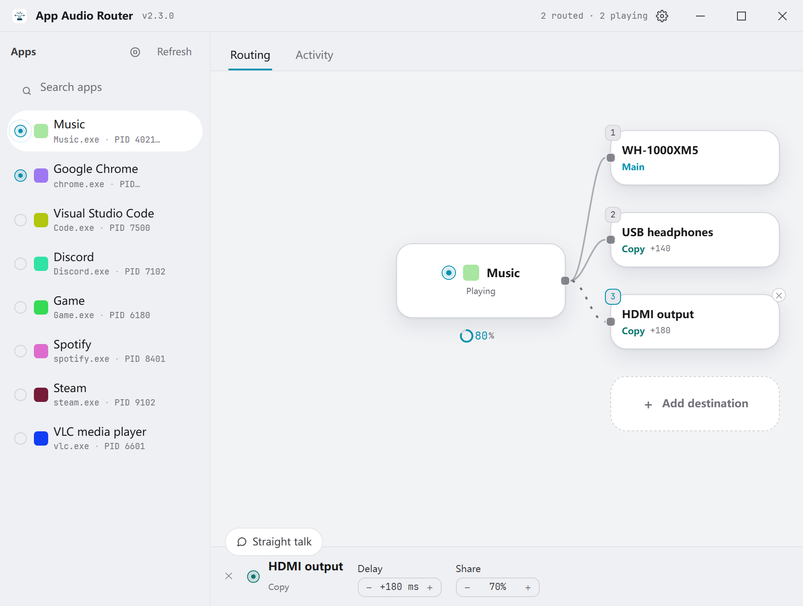
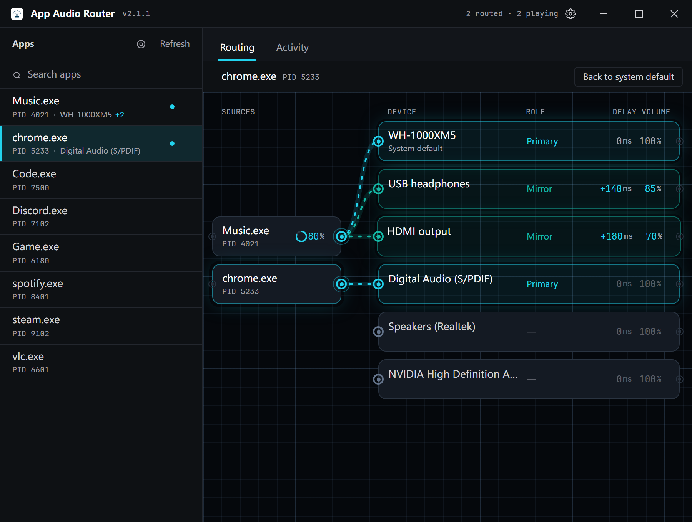

<p align="center">
  
</p>

# App Audio Router

**Windows 每应用音频路由工具：把某个程序的音频同时送到多台播放设备，并且每台设备都能单独设置延迟补偿与音量。**

<p align="center">
  <a href="https://github.com/Eververdants/AppAudioRouter/actions/workflows/ci.yml"></a>
  
  
  <a href="LICENSE"></a>
  
</p>

<p align="center">
  <a href="README.md">English</a> · <strong>简体中文</strong>
</p>

> **App Audio Router 是一款面向 Windows 10 / Windows 11 的免费开源桌面应用，可以把单个应用程序的音频路由到你指定的播放设备。** 它能让同一个程序的声音同时输出到多台设备，并且可以逐台微调——用延迟补偿把蓝牙耳机和有线音箱对齐，用音量把各台设备的响度拉平。全部功能由单一原生程序直接调用 Windows Core Audio API 完成：既不需要安装虚拟声卡驱动，也不依赖任何第三方可执行文件。

---

## 这是什么

App Audio Router（简称 **AAR**）是一个 Windows 每应用音频路由工具。Windows 本身只允许一个程序同时向一路输出播放声音，App Audio Router 解除了这个限制：选中一个程序、选中一台或多台播放设备，它的声音就会实时送到全部设备上，**不需要重启该程序**。

它面向的是普通用户而不是音频工程师。没有混音矩阵、没有虚拟声卡、也不用装驱动——整个应用只有一个窗口：左侧是进程列表，右边是一张路由画板——每个被路由的程序在左侧是一个源节点，每台输出设备在右侧是一个节点，程序与设备之间的每一根连线就是一条路由，谁的声音正在往哪里走一眼看完；确认动作是一枚悬浮胶囊，运行日志在隔壁那个标签页里。

| | |
|---|---|
| **定位** | Windows 每应用音频路由（一个应用 → 多台设备） |
| **平台** | Windows 10 / Windows 11，64 位 |
| **当前版本** | 2.1.1 |
| **安装包** | 见 [Releases](https://github.com/Eververdants/AppAudioRouter/releases)，MSI 或 NSIS 安装程序 |
| **许可证** | MIT |
| **界面语言** | 简体中文、English |
| **外部依赖** | 无——不需要虚拟声卡驱动，也没有辅助进程 |
| **技术栈** | Tauri 2、Rust、React 19、TypeScript、TailwindCSS、Vite |
| **源码** | https://github.com/Eververdants/AppAudioRouter |

## 界面截图

同一张画板在两种主题下的样子：`Music.exe` 的主设备是蓝牙耳机，USB 耳机与 HDMI 输出各收到一份镜像副本，`chrome.exe` 则播到数字输出。左侧每个源节点是一个被路由的程序——Music 的节点上还挂着它的电平环——每根连线是一个「程序 → 设备」对，正在发声的程序带着流动的虚线；被路由的设备排在设备列最前，延迟与音量写在节点自己的列里。标题栏留着计数：已路由 2 · 在响 2。





## 功能特性

### 路由

- **一个应用 → 多台设备。** 可以选中一个或多个进程（`单击` 单选，`Ctrl`+`单击` 多选），再选中一台或多台设备，声音会同时镜像到全部设备。
- **即时生效。** 正在运行的程序会被直接改到选中的设备上，不需要重启，也不需要重开设置窗口。
- **有序的设备列表。** 第一台设备成为该程序的原生输出端点，由 Windows 直接播放；其余每台设备都会收到一路实时的音频副本。
- **随时停止。** 停止路由后，程序交还给系统默认播放设备——路由期间 Windows 给它固定的那台输出设备会被释放，所以之后手动切换默认设备，这个程序照样跟着走。
- **不留痕迹。** 一条路由只在运行时留下一样东西：Windows 为这个程序固定的输出设备。停止路由、退出程序、以及**设置 → 重置每应用音频输出**都会把它交还；路由期间退出过的程序，下次出声时会自动收回。
- **自动记忆。** 路由规则按可执行文件名保存，该程序下次出声时自动恢复。
- **镜像失败会说清楚。** 多设备路由里某台设备打不开时，引擎继续为其余设备播放，日志会点名那台没声音的设备——只活了一半的路由不该看起来像完全生效。

### 逐设备微调

- **延迟补偿**——每台设备一个有符号毫秒值，用来把"快"的设备对齐到"慢"的设备，例如让有线音箱对齐蓝牙耳机（后者的编解码与缓冲本身就有硬件延迟）。范围与步进都可配置（范围 ±1/2/5/10 秒；步进 1/10/50/100/1000 ms，默认 10 ms）。
- **音量平衡**——每台设备一个 0–100 % 的值，把该设备相对"同组里最响的那台"做衰减，让轻的耳机和响的音箱拉到同一水平。
- **实测延迟**——每台设备此刻实际在播的软件侧延迟，取自正在运行的流。它是读数而不是设定值，所以放在延迟值鼠标悬停的提示里，而不是紧挨着它显示：格子里是你设的值，提示里是它实际在做的。
- **数值即控件**——横向拖动、滚轮、方向键（按住 `Shift` 十倍步进），或点击后直接键入精确值。两个数值都在设备节点自己的列里，共用同一套操作方式；这两列属于专家信息，在设置里打开**高级选项**后才会出现。
- **生不生效会说明**——这两个值都由复制引擎施加，所以只对"收到副本"的设备起作用。单设备路由没有副本（那台设备由 Windows 直接播放），此时读数会变淡并注明当前不生效；多设备路由里主设备那一行的提示则说明它的数值是整组的基准，而不是施加在它自己身上。

### 不占地方

- **列表实时更新**——设备列表与进程列表自己跟着音频引擎走：插上耳机、某个程序开始或停止播放，不用点刷新列表也会跟上。用的是 Core Audio 自己的变更通知，不是定时器。
- **一份程序、一个托盘图标**——程序已在运行时再次启动它，不会开出第二个进程，而是把已有窗口唤到最前。两个实例会抢同一批配置文件和同一批音频设备。
- **系统托盘**——运行期间托盘图标常驻：左键显示或隐藏窗口，右键菜单是「显示 / 隐藏」与「退出」。
- **关闭到托盘**——可选：点关闭只隐藏窗口，路由继续生效，屏幕上不再占一个窗口。此项默认关闭；托盘菜单里的**退出**才是明确停止路由的动作。
- **开机自动启动**——可选：在你自己的用户下登记一条启动项（`HKCU\Software\Microsoft\Windows\CurrentVersion\Run`），登录时静默进托盘、不弹窗口，不需要管理员权限。同一个开关可以关掉，任务管理器 → 启动应用里也能关掉；开关读的就是注册表本身，所以它显示的永远是实际状态。

### 界面与开销

- **一张画板，不是一张表单**——进程列表是一条侧栏，路由页是一张节点画板：每个被路由的程序在左侧是一个源节点，每台输出设备在右侧是一个节点，节点之间的连线**就是**路由，颜色按「这条路由对这台设备做了什么」来画（Windows 直接播放的那台是 accent 色的主设备，副本是青绿色，选了还没确认的是琥珀色）。正在发声的程序带着自己的流动：它的连线跑一段缓慢的移动虚线，程序一停虚线就停。程序自己的电平作为一枚小环挂在它的节点上，标题栏里留着一行安静的计数——「已路由 2 · 在响 2」。用分隔线与 hairline 代替卡片、用文字代替药丸按钮，所有数值都用等宽字体。
- **进程列表搜索**——边输入边按名称过滤，正在被路由的程序始终排在最前，鼠标底下的目标不会跑掉；`Escape` 清空搜索。
- **明暗双主题**，中英双语，都在标题栏一键切换；主题与语言在首帧之前就已生效，启动时不会闪一下白屏。
- **后台开销低**——程序从不轮询音频引擎，只在 Windows 报告「有东西变了」时才重读列表；重读之后如果屏幕上没有任何变化，连日志都不多写一行。界面上唯一会自己动的东西，是正在发声的程序那几根连线上的流动虚线——而且只在窗口可见、持有焦点、且系统未要求减少动效时才会存在；窗口隐藏、失焦或程序静音时，连线回到静止，界面不再产生任何重绘。已生效的路由在程序安静时同样几乎不花钱：被路由的程序超过一秒半没有出声，引擎就停止向它的镜像设备送数据，而不是一直往这些设备里写静音。
- **冷启动快**——窗口先隐藏创建、首帧绘制完成后再显示（Rust 侧另有看门狗兜底），设备枚举等到首帧之后的空闲时机才发起，发布配置也针对"体积小、映像紧凑"调过（LTO、单一 codegen unit、剥离符号、`panic = "abort"`）。

## 与其它方案对比

| 能力 | **App Audio Router** | Windows 自带的按应用输出 | 虚拟声卡混音方案（Voicemeeter / VB-CABLE 一类） | 按应用切换默认设备（EarTrumpet 一类） |
|---|---|---|---|---|
| 一个应用同时输出到多台设备 | **支持** | 不支持，一个应用只能选一路 | 支持，通过混音总线 | 不支持 |
| 对正在运行的程序即时生效 | **支持** | 支持 | 支持 | 支持 |
| 逐设备延迟对齐（蓝牙同步） | **支持**，每台设备一个有符号毫秒值 | 不支持 | 需手动逐总线设置 | 不支持 |
| 逐设备响度平衡 | **支持**，每台设备 0–100 % | 不支持 | 支持，用总线增益 | 不支持 |
| 逐程序电平对齐 | **支持**，每程序 0–400 %，电平环挂在程序的节点上，一键对齐 | 不支持 | 支持，但每条通道都要手设 | 不支持 |
| 同时能路由的程序与设备数 | **没有内建上限**——每个被路由的程序各自独立 | — | 总线数固定（按版本 3/5/8 条） | 不支持 |
| 按程序记住路由 | **支持**，自动记忆 | 支持（两者本质是同一个 Windows 设置） | 在 Windows 里配置，混音器本身不记 | 继承 Windows 的按应用设置 |
| 是否需要虚拟声卡驱动 | **不需要** | — | 需要 | — |
| 费用 | **免费，MIT 开源** | 随 Windows 提供 | 免费或自愿付费 | 免费，MIT 开源 |

*其它几列描述的是这些方案公开文档中的一般行为，具体功能请以各自的官方文档为准。*

## 系统要求

- **Windows 10 或 Windows 11，64 位。**
- WebView2 运行时——Windows 11 自带，装有 Microsoft Edge 的 Windows 10 也基本都有。
- 安装版就只需要这些：不用装声卡驱动、不用装服务、没有第三方可执行文件。

从源码构建还需要 Node.js 20 或更高版本、pnpm 10，以及带 MSVC 目标的 stable Rust 工具链和 Tauri 构建所需的 WebView2 工具。

## 安装

1. 打开 [Releases](https://github.com/Eververdants/AppAudioRouter/releases) 页面。
2. 从最新版本下载 `.msi` 安装包（或 NSIS `.exe` 安装程序）。
3. 安装后启动 **App Audio Router**。

想自己构建请见 [从源码构建](#从源码构建)。

## 快速上手

1. **先在要路由的程序里放点声音。** 程序只有拥有活动音频会话时才会出现在进程列表里——路由是按会话走的，不是按快捷方式。
2. **在进程列表里选中它。** 单击选中一个进程，或 `Ctrl`+`单击` 多选，一次路由应用到全部选中的进程。
3. **在画板上点击目标播放设备。** 已排入的设备标为 *待确认*；第一台是主设备，其余每台都会得到一份镜像副本。
4. **确认那枚胶囊**（`路由`），它会同时说出是哪个程序、即将播到哪台设备。路由生效后，这个程序的连线留在画板上——Windows 直接播放的那台标 *主设备*，每个副本标 *镜像*——程序出声时连线开始流动。
5. **需要时逐台微调。** 直接在设备节点自己的延迟列与音量列里拖动数值（先在设置里打开**高级选项**才会出现这两列）。
6. **在设置里打开"自动记忆"**，该程序下次出声时会自动恢复这条路由。

## 延迟补偿原理

同一段音频送到两路输出，只要其中一路是蓝牙耳机，听起来就不会同步：编解码和耳机自身的缓冲带来了有线通路没有的延迟。延迟补偿就是让声音在同一时刻到达两台设备。

- **每台设备各自保存一个有符号毫秒值**，基准是应用程序的音频，而不是"以某台设备为准"。
- **正值把该设备往后压；负值则把它标记为整组里最早的一台**，改为把其它设备抬起来。
- **软件只能加延迟、不能减延迟。** 因此组内最早的那台就是基准：它由 Windows 直接播放，其余设备按差值被往后压。你配置的**相对差一定被精确还原**，绝对值会被归一化到最早的那台。
- **路由按延迟从小到大应用**，所以最早的那台通常就是主设备（Windows 直连的那台）。运行中把某个延迟调小，只会让整组平移，不会产生爆音。
- **范围与步进都可以自己定**（设置 → 延迟补偿）：范围 ±1/2/5/10 秒，步进 1/10/50/100/1000 ms（默认 10 ms）。缩小范围时，超出新范围的已存数值会被钳制。
- **延迟需要有东西可以被延迟。** 它由镜像副本实现，所以只有在这条路由至少还有一台设备收到副本时才存在。把程序路由到单台设备时，那台由 Windows 直接播放：数值会留着等你加第二台设备用，读数则会变淡并注明当前不生效——而不是显示一个看起来在起作用的数字。

## 音量平衡原理

延迟解决的是声音**什么时候到**，音量解决的是每台设备**有多响**。

- **每台设备一个 0–100 % 的值。** 100 % 表示原样输出；数值越低衰减越多；0 % 即静音。
- **这个值是相对"同组里最响的那台"而言的。** 引擎按 `自身 / 最大值` 缩放每一路镜像，所以软件增益只能衰减——最响的那台就是基准，其余设备向它对齐。
- **主设备（Windows 直连的那台）自己的数值不会被应用在它身上**，但它依然参与基准计算，因此它决定了其它设备要被压低多少。
- **和延迟一样，它需要有镜像副本才能施加。** 单设备路由没有副本，也就没有任何衰减；此时读数会变淡并说明这一点，一个不起作用的数值不会被显示得像在起作用。
- 音量按设备保存，并会即时推送到正在运行的路由上，改完立刻能听出来。

## 实测延迟的含义

延迟补偿是你**要**的值；延迟值悬停提示里的那个数，是它**此刻**在做的。

- **它是逐设备、从正在运行的流上量出来的**——该设备的引擎管线（基础延迟加上它承担的延迟补偿），再加端点自己报告的流延迟。它跟着你设的值走，而不是把那个值复述一遍，所以改延迟这个数会动。
- **由 Windows 直接播放的那台设备没有读数。** 它上面没有我们自己的流可以量，所以应用不会编一个数字出来，而是在悬停提示里说明它测不到。
- **编解码器或蓝牙链路额外增加的部分在这之上，不在这个数里。** 那部分用户态程序看不到，应用也不去猜——请把这个数当作这条通路的**下限**，而不是全部。

## 电平对齐原理

延迟解决的是声音**什么时候到**，设备音量解决的是**每台设备多响**。这两件事都没碰另一个问题：一个应用本来就比另一个轻——比如游戏的混音对比语音通话的混音。

- **每个程序有一个自己的 0–400 % 电平**，由引擎施加在该程序的音频上、送往**它被复制到的那些设备**。100 % 表示原样；低于它衰减，高于它放大。**这不是那个应用自己的音量**，也从不改动它——本应用之外没有任何东西看得到它，Windows 里也不会有它的记录。和设备音量、延迟一样，它只作用在镜像副本上：**Windows 直接播放的那一台不受它影响**。
- **一键把所有程序对齐。** 正在放音的每一个被路由程序，都被抬/压到最响那条的电平，再留一点余量。
- **它「测过的那段素材」不会被推到削顶。** 每条增益被两道界压着：**该程序自己的实测峰值**（`1/peak` 恰好把它最响的样本放到满刻度，再也过不去），以及**电平上限**——超过约 +12 dB，程序的噪声底会跟着信号一起抬起来。所以这里哪里都不需要限幅器。但这个上限是对**测量当时正在播的东西**而言的，而增益算一次就会一直用下去：一个当时安静、之后变响的程序仍可能被推进削顶，听出来就把它的电平调低。
- **没在放音的程序原样不动**，日志里会点名它。对着静音做对齐，等于对着「没有」做对齐。
- **多个程序同时放音时，它们仍然会在设备端相加**，而那次相加发生在 Windows 的混音器里、本应用看不到。余量是礼让而不是保证：同时放的程序一多，能动的仍然是设备音量。
- **只有被路由的程序才有电平**，因为这个电平是引擎对自己捕获到的音频施加的。只路由到一台设备的程序也没有引擎——那台设备由 Windows 直接播放——所以它的节点上没有电平环；先把它路由到第二台设备，环才会出现。

## 工作原理

| 步骤 | 做了什么 |
|---|---|
| 1 | 用 `IMMDeviceEnumerator` 枚举当前活动的渲染（播放）端点。 |
| 2 | 用 `IAudioSessionEnumerator` 枚举当前持有音频会话的进程。 |
| 3 | 用 `IPolicyConfig` 把选中进程的会话（全部角色）指向目标端点——与 Windows 自带的按应用输出设置是同一套机制。 |
| 4 | 对其余每台设备，用 **WASAPI 进程回环（process loopback）** 按 PID 抓取音频，再喂给目标设备上的 `IAudioClient` 渲染客户端。延迟用 ring buffer 的积压实现（静音是**加在音频前面**，绝不是后面，所以提高延迟时不会先冒出一段声音）；音量则是写设备之前逐采样施加的增益。 |
| 5 | 采样格式从端点的 `WAVEFORMATEX` 解析：float32、float64、PCM 16/24/32 会被缩放，认不出的格式原样透传而不是乱改；增益恰好为 1.0 时直接短路，所以 100 % 时这条通路不付任何代价。 |
| 6 | 路由规则、延迟、音量与程序电平都以 JSON 保存在应用数据目录下（`route-memory.json`、`device-delays.json`、`device-volumes.json`、`source-volumes.json`）。 |
| 7 | 每个复制引擎结束（用户停止、进程退出或出错）都会通过 `duplication-stopped` 事件通知前端；跨越应用重启仍然存活的路由会在启动时对账，保证界面状态与实际情况一致。单台设备打不开则走另一条事件（`duplication-mirror-failed`）：引擎还在为路由里其余设备播放，界面必须说得出是哪一台没了声音。 |

路由规则以**可执行文件名**为键，而不是 PID，所以记忆下来的路由在重启后依然有效。

## 技术栈

| 层级 | 技术 |
|---|---|
| 桌面框架 | Tauri 2 |
| 前端 | React 19 + TypeScript（strict） |
| 样式 | TailwindCSS 3（utility-first + CSS variables） |
| 动画 | Motion（`framer-motion`） |
| 构建 | Vite 6 |
| 状态 | Zustand |
| 国际化 | i18next / react-i18next（简体中文、English） |
| 后端 | Rust（edition 2021）+ 官方 `windows` crate——直接调用 Core Audio，无第三方音频库 |

## 项目结构

```
AppAudioRouter/
├── src/                          # React 前端
│   ├── components/
│   │   ├── RouteCanvas.tsx       # 路由画板：源节点、设备节点与连线
│   │   ├── SourceNode.tsx        # 一个被路由的程序，挂着它的电平环
│   │   ├── DeviceNode.tsx        # 一台输出设备：名称 / 角色 /（高级）延迟 / 音量
│   │   ├── EdgeLayer.tsx         # 所有连线画在一张 svg 上，程序在响时流动
│   │   ├── SourceLevelDial.tsx   # 每程序电平：端口旁的一枚环
│   │   ├── RouteConfirmCapsule.tsx # 悬浮确认胶囊：「这个程序 → 那台设备，路由吗？」
│   │   ├── ProcessList.tsx       # 有音频会话的进程
│   │   ├── SettingsPage.tsx      # 设置页：主题 / 语言 / 路由 / 后台 / 延迟 / 关于
│   │   ├── LogPanel.tsx          # 运行日志（第二个标签页）
│   │   ├── TitleBar.tsx          # 自制无边框标题栏，带「已路由 / 在响」计数
│   │   └── ui/                   # Switch、UnderlineTabs、SegmentedControl、ScrubReadout 等基础控件
│   ├── hooks/                    # useTheme、useLanguage、useDelayValue、useBackendEvent、useLiveness
│   ├── stores/routerStore.ts     # Zustand store
│   ├── i18n/locales/             # en.json、zh-CN.json
│   ├── lib/                      # invoke 封装、延迟计算、共享类型
│   └── styles/index.css          # Tailwind 入口 + 主题 CSS variables
└── src-tauri/                    # Rust 后端
    └── src/
        ├── main.rs               # 入口，注册命令 + 关闭拦截
        ├── commands.rs           # Tauri 命令（invoke handler）
        ├── config.rs             # 路由 / 延迟 / 音量 / 外壳设置持久化
        ├── tray.rs               # 托盘图标、菜单与窗口开关
        ├── autostart.rs          # 开机自启（HKCU Run 项）
        ├── install.rs            # 首次启动 / 更新后提示（建窗口之前判定）
        ├── single_instance.rs    # 命名互斥 + 命名事件：第二次启动唤出已有窗口
        └── audio/
            ├── devices.rs        # IMMDeviceEnumerator 设备枚举
            ├── sessions.rs       # IAudioSessionEnumerator 会话枚举
            ├── routing.rs        # IPolicyConfig 按进程路由
            ├── duplication.rs    # WASAPI 进程回环复制引擎
            └── notifications.rs  # 设备与会话变更回调
```

## 从源码构建

```bash
git clone https://github.com/Eververdants/AppAudioRouter.git
cd AppAudioRouter
pnpm install

pnpm tauri dev        # 开发模式（热重载）
pnpm tauri build      # 安装包输出在 src-tauri/target/release/bundle
```

CI 里同样会跑到的检查：

```bash
pnpm typecheck                 # tsc --noEmit
pnpm build                     # tsc -b && vite build
cd src-tauri
cargo fmt -- --check
cargo clippy -- -D warnings
cargo check
```

CI 流程：前端类型检查与构建跑在 Linux 上，`cargo fmt` / `check` / `clippy` 跑在 Windows 上，打 tag 发版前还会先执行 `cargo audit`。

## 常见问题

### App Audio Router 是免费的吗？

是。它以 MIT 许可证开源，没有付费版本，也不需要注册账号。

### 能让同一个应用同时输出到两台（或多台）设备吗？

可以，这正是它的主要用途。在画板上选中多台设备后确认即可：第一台由 Windows 原生驱动，其余每台设备都会实时收到同一路音频的镜像副本。

### 需要像 VB-CABLE 那样的虚拟声卡驱动吗？

不需要。路由、复制、延迟与增益全部由应用的 Rust 程序直接调用 Windows Core Audio API 完成，不会向音频栈里安装任何东西，卸载后也不会残留驱动。

### 对已经在运行的程序有效吗？

有效。路由是作用在实时音频会话上的，程序不需要重启——正在播放的游戏或浏览器标签页会在播放中切到新设备。

### 停止路由之后，程序还会跟随系统默认设备吗？

会，这正是 2.1.1 修掉的问题。程序被路由期间，Windows 会为它存下一台固定的输出设备——移动运行中程序的声音靠的就是这个机制——而这台固定设备优先于系统默认设备。停止路由、退出程序、以及**设置 → 重置每应用音频输出**都会释放它，程序重新跟随默认设备，之后你换任何设备它也跟着。如果 Windows 拒绝释放，日志会写明这个程序仍被固定在哪台设备，而不是假装路由已经彻底结束；音量合成器里针对该程序的**重置**同样能清掉。2.1.1 之前的版本在停止后会把固定设备留在那里，这就是为什么程序可能一直在旧设备上出声、或者对你的设备切换毫无反应，直到手动重置为止。

### 更新后第一次打开，为什么弹了一个提示？

一次性的，只说一次。Windows 按可执行文件保存程序的输出设备，程序退出后这条记录仍然存在，所以某个版本如果在停止路由时没有把它交还（2.1.1 及更早），就可能把某个程序固定在某一台设备上——它不再跟随你在 Windows 里切换的播放设备，重启电脑也恢复不了。这件事没法自动判断：应用分不出「旧版本留下的固定」和「你自己在音量合成器里设的分配」，所以它不会自己动手清，而是在更新后的第一次启动时说明情况，并直接在提示里给出**重置每应用音频输出**。没有程序出问题就不用管。全新安装看到的是两行欢迎语，末尾同样会提到这个重置。两种提示每个版本只出现一次（上次运行的版本号记在 `install-state.json` 里），内容也会写进日志。

### 能解决蓝牙耳机和有线音箱之间的延迟不同步吗？

可以，这就是延迟补偿的用途。先估出蓝牙设备落后多少，再把"快"的那台设备设成对应的正值延迟（例如 `+180 ms`）。正值把设备往后压；负值表示这台是整组最早的一台。

### 为什么我的程序没有出现在进程列表里？

程序只有在持有活动音频会话时才会出现，所以先在它里面播放声音——列表会自己注意到，或者点**刷新**。使用 ASIO 或 WASAPI 独占模式的程序不会向系统音频引擎创建会话，因此不会出现在列表里；系统关键进程也被有意排除在路由之外。

### 配置保存在哪里？

以纯 JSON 保存在应用数据目录下：`route-memory.json`（可执行文件 → 设备列表）、`device-delays.json`（设备 → 毫秒值与配置的范围）、`device-volumes.json`（设备 → 百分比）、`source-volumes.json`（可执行文件 → 电平百分比，可以高于 100）、`app-settings.json`（关闭按钮是否只隐藏到托盘）以及 `install-state.json`（上次运行的版本号，用来区分「更新」和「全新安装」）。主题与语言属于窗口自己的界面偏好，存在它的 localStorage 里。唯一不在这些文件中的是那条可选的开机启动项，它在 `HKCU\Software\Microsoft\Windows\CurrentVersion\Run` 下——「开机自动启动」开关读的也正是它。记忆的路由以可执行文件名为键，所以不管程序从哪里启动都适用。

### 延迟补偿能全自动校准吗？

真正要紧的那一半不能，而理由值得说清楚。本应用能控制的这一侧已经全部测出来并显示在那里了：每台设备你都能看到引擎为它保持的管线，加上端点自报的流延迟，而且是**随你改动延迟实时变化**的。这一半以前才是靠猜的。

另一半是音频离开 Windows 之后、编解码器或蓝牙链路额外加上去的部分，用户态程序看不到——唯一测得到的办法是把声音从各设备放出来、用**麦克风**录下房间，再把录音对齐。本应用不申请你的麦克风，也不猜自己听不到的东西，所以延迟值仍然由你靠耳朵放。屏幕上那些数字的作用，就是让这件事从「凭感觉瞎调」变成「看着数字调」。

### 能比虚拟声卡混音方案多给几条通道吗？

没有「通道数」可以提，因为这个应用不是总线混音器。每个被路由的程序拿到的是它自己的一份引擎，而不是共享总线上的一条通道，所以程序之间互相独立，一次路由多少个程序、多少台设备都没有上限。也就没有「总线条数用完了」这件事——而那正是用 Voicemeeter 的人会撞到的上限（三个、五个或八个总线）。

### 为什么某个程序不在电平列表里？

因为它没有被路由。电平是复制引擎对它已经捕获到的音频施加的，所以没有引擎的程序就没有这条路径，也就没有东西可设。先把它路由起来，再来设或对齐它的电平。

### 调电平会改变应用自己的音量吗？

不会，而且这个区分是刻意的。电平是本应用对「从那个程序捕获到的音频」施加的增益，作用在通往它被复制到的那些设备的路上；程序本身、以及 Windows 里关于它的任何记录，都不受影响。把某个程序的电平拉到静音，它自己的音量滑块一点没动——不过要注意，和设备音量、延迟一样，它到不了 Windows 直接播放的那一台。

### 它会在后台常驻或轮询音频设备吗？

不做轮询，也没有后台服务。程序注册的是音频引擎自己的变更通知，只有 Windows 报告「有东西动了」才会重读列表——设备与进程列表的实时更新就是这么来的。除此之外，只有在你刷新列表、调整设备数值或应用路由时才会与音频引擎通信。路由生效期间，对应进程的复制引擎会运行；一旦停止路由，引擎就被拆除。

路由生效期间，引擎的开销只与它在搬运的声音相称。音频设备只要流还开着，就必须每几毫秒被喂一次，所以一个程序不发声时仍一直往里写静音，会把 CPU 长期挡在低功耗状态之外——这笔代价表现为风扇声，而不是任务管理器里的任何数字。因此被路由的程序超过一秒半没有出声时，引擎会停止向它的镜像设备送数据并停放，等程序再次发声才继续。停顿之后的第一声与平时延迟一致，因为设备被重新喂数据之前，管线深度会先重建。

界面同样不会有任何东西在后台重绘：已经没有装饰性动效可跑了——不再有背景漂移光晕、轨道环、脉冲环，也不再有流动的路由虚线。画面自己就是静止的，唯一还在动的只有那些「报告状态」的动效（选中标记移动、确认胶囊浮出、标签页下划线迁移）。

### 可以同时开两个程序副本吗？

不可以，这是有意的。程序已经在运行时再次启动它，不会开出第二个进程，而是直接把已有窗口唤到最前：两个实例会抢同一批配置文件和同一批音频设备，而且一个路由引擎配两个托盘图标，只会让你分不清是哪个副本在干活。开机自启（静默进托盘）的那次启动里再点一次快捷方式也一样会把窗口唤出来，不会出现"点了没反应"。（另一个 Windows 登录会话——比如另开一个 RDP 会话——各有各的实例，音频引擎本来就是按会话走的，两边没有任何可抢的东西。）

### 路由里有一台设备没声音，怎么查是哪台？

日志会告诉你。某台设备打不开、无法参与镜像播放时，它会从这条路由的设备计数里掉出去，并留下一行点名该设备与错误原因的日志，其余设备继续出声。程序不会在背后反复重试；等它可用了，重新应用一次路由（或重新插上设备）即可。

### 把窗口关掉以后还在路由吗？

默认情况下，关闭窗口就是退出程序，依赖复制引擎的那份声音随之停止——退出时会把这个程序固定过的输出设备一并交还系统默认。打开**设置 → 后台运行 → 关闭窗口时最小化到托盘**之后，关闭按钮只隐藏窗口：路由继续生效，托盘图标可以把窗口唤回来。托盘菜单里的**退出**无论开关状态都会停止一切。

### 可以开机自动启动吗？

可以。**设置 → 后台运行 → 开机自动启动** 只在你当前用户下的 `HKCU\Software\Microsoft\Windows\CurrentVersion\Run` 写一条值：不碰 `HKLM`，不需要管理员权限，启动时也不弹窗口——直接进托盘，记忆路由在你打开任何程序之前就已就绪。程序是把这条注册表值当作唯一真相来读的，所以你在任务管理器里关掉启动项，设置里的开关也会跟着变。

### 支持 macOS 或 Linux 吗？

不支持。路由机制建立在 Windows Core Audio 之上，因此仅支持 Windows（Windows 10 / 11，64 位）。

## 限制与注意事项

- 程序必须在运行且正在发声才会出现在进程列表里——路由针对的是活动音频会话，从不发声的程序没有可搬动的东西。
- 记忆的路由按可执行文件名匹配，不区分完整路径，也不记录 PID。
- 延迟补偿只能**增加**延迟。组内最早的那台是对齐基准，无法被提前——这也是路由按延迟顺序应用的原因。
- 镜像是为了稳定而缓冲的（约 100 ms 的管线延迟），目的是让各镜像在同一时刻播放同一个采样。镜像之间的对齐是精确的；镜像相对主设备（由 Windows 原生播放）的这点偏移是"抓取再渲染"本身带来的。
- 音量只能衰减，所以组内最响的那台就是基准，无法被压到比程序原本给它的电平更低。
- 延迟与音量都只作用在镜像副本上，因此单设备路由下两者都不生效；数值会留着，等你加上第二台设备时使用。
- 程序被路由期间，Windows 会为它**固定一台输出设备**，而且这个记录是按可执行文件存的，程序退出后依然在。以下任一操作会把它交还：停止路由、退出本程序、程序路由期间退出后再次出声（自动收回），或**设置 → 重置每应用音频输出**。旧版本留在那里的固定记录，在这之前都会让程序无视系统默认设备（音量合成器里针对该程序的**重置**同样能清掉）。
- 释放固定记录需要程序正在运行：音频服务是按进程寻址的，所以已经关掉的程序要等到它再次出声才能收回。
- 系统关键进程的路由请求会被拒绝，而不是半途应用。

## 参与贡献

欢迎在 [Eververdants/AppAudioRouter](https://github.com/Eververdants/AppAudioRouter) 提 Issue 或 Pull Request。提交信息遵循 [Conventional Commits](https://www.conventionalcommits.org/)，并且**一个提交只做一件事**，保持 diff 精简；代码库内的具体约定见 [AGENTS.md](AGENTS.md)。

## 许可证

[MIT](LICENSE) © 2026 Eververdants
